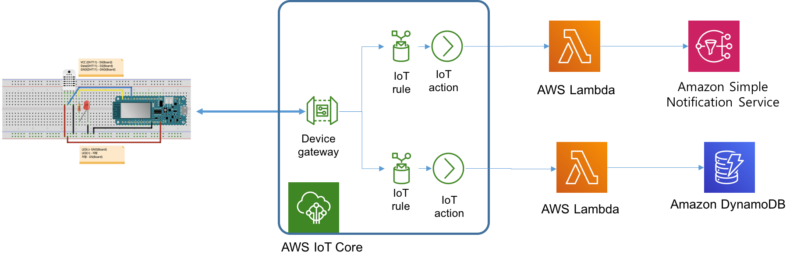
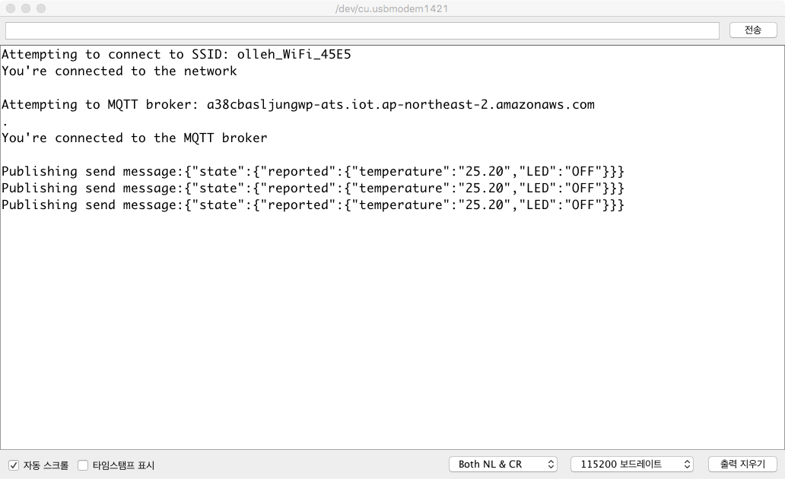

# DynamoDB를 이용한 백엔드 구축하기

## 학습내용

- [Amazon DynamoDB](#1)
- [Java를 이용한 Amazon DynamoDB 실습](#2)
- [DynamoDB와 AWS Lambda를 이용한 IoT Data 저장 백엔드 구축 실습](#3)
- [DynamoDB와 AWS Lambda를 이용한 IoT Data 저장 백엔드 구축 실습 (수정)](#4)

---

<a name="1"></a>

## 1. Amazon DynamoDB란?

- **Amazon DynamoDB**는 어떤 규모에서도 10밀리초 미만의 성능을 제공하는 **키-값** 및 **문서** 데이터베이스입니다.
  
  - DynamoDB는 유연한 스키마를 가지므로 어느 시점에서든 각 행은 개수와 상관없이 열을 포함할 수 있습니다. 따라서 관계형 데이터베이스에서처럼 **테이블 스키마를 재정의할 필요 없이 비즈니스 요구사항이 변경되면 테이블을 쉽게 조정**할 수 있습니다.

- **완전관리형**의 내구성이 뛰어난 다중 리전, 다중 마스터 데이터베이스로서, 인터넷 규모 애플리케이션을 위한 보안, 백업 및 복원, 인 메모리 캐싱 기능을 기본적으로 제공합니다.

- DynamoDB 소개영상 :     https://www.youtube.com/embed//sI-zciHAh-4

### 1.1 DynamoDB 핵심 구성 요소

다음은 기본 DynamoDB 구성 요소입니다.

- **테이블** – 다른 데이터베이스 시스템과 마찬가지로 DynamoDB는 데이터를 테이블에 저장합니다. 테이블은 데이터의 집합입니다. 예를 들어, 친구, 가족 또는 기타 관심 있는 사람에 대한 정보를 저장하는 데 사용할 수 있는 People이라는 예제 테이블을 살펴 봅니다. 또한 Cars 테이블에 사람들이 운전하는 차량에 대한 정보를 저장할 수도 있습니다.

- **항목** – 각 테이블에는 0개 이상의 항목이 있습니다. 항목은 모든 기타 항목 중에서 고유하게 식별할 수 있는 속성들의 집합입니다. People 테이블에서 각 항목은 한 사람을 나타냅니다. Cars 테이블의 경우 각 항목은 차량 한 대를 나타냅니다. DynamoDB의 항목은 여러 가지 면에서 다른 데이터베이스 시스템의 행, 레코드 또는 튜플과 유사합니다. DynamoDB에서는 테이블에 저장할 수 있는 항목의 수에 제한이 없습니다.

- **속성** – 각 항목은 하나 이상의 속성으로 구성됩니다. 속성은 기본적인 데이터 요소로서 더 이상 나뉠 필요가 없는 것입니다. 예를 들어 People 테이블의 항목에는 PersonID, LastName, FirstName 등의 속성이 있습니다. Department 테이블의 경우 항목에 DepartmentID, Name, Manager 등의 속성이 있을 수 있습니다. DynamoDB의 속성은 여러 가지 면에서 다른 데이터베이스 시스템의 필드 또는 열과 유사합니다.

- **예제 (People 테이블)**
  
    
  
  - 테이블의 각 항목에는 항목을 테이블의 다른 모든 항목과 구별해 주는 고유 식별자인 **기본 키**가 있습니다. People 테이블에서 기본 키는 한 개의 속성(*PersonID*)으로 구성됩니다.
  - **기본 키를 제외하고, People 테이블에는 스키마가 없습니다**. 이는 속성이나 데이터 형식을 미리 정의할 필요가 없음을 의미합니다. 각 항목에는 자체의 고유 속성이 있을 수 있습니다.
  - 대부분의 속성은 스칼라인데, 이는 하나의 값만 가질 수 있다는 의미입니다. 문자열 및 숫자가 스칼라의 일반적인 예입니다.
  - 일부 항목은 내포 속성(Address)을 갖습니다. DynamoDB는 32 수준 깊이까지 내포 속성을 지원합니다.

- **예제 (Music 테이블)**
  
    
  
  - Music의 **기본 키는 두 개의 속성(Artist 및 SongTitle)으로 구성**되어 있습니다. 테이블의 각 항목이 이러한 두 속성을 가지고 있어야 합니다. Artist와 SongTitle의 조합은 테이블의 각 항목을 다른 모든 항목과 구별해 줍니다.
  - 기본 키를 제외하고, Music 테이블에는 스키마가 없습니다. 이는 속성이나 데이터 형식을 미리 정의할 필요가 없음을 의미합니다. 각 항목에는 자체의 고유 속성이 있을 수 있습니다.
  - 항목 중 하나에는 내포 속성(PromotionInfo)이 있는데, 이 속성은 다른 내포 속성을 포함합니다. DynamoDB는32 수준 깊이까지 내포 속성을 지원합니다.

### 1.2 기본 키

- 테이블을 생성할 때는 테이블 이름 외에도 테이블의 **기본 키**를 지정해야 합니다.
  
  - 기본 키는 테이블의 각 항목을 나타내는 고유 식별자입니다.

- DynamoDB는 두 가지의 기본 키를 지원합니다.
  
  - **파티션 키** - *파티션 키*로 알려진 **하나의 속성으로 구성되는 단순 기본 키**.
    
    - DynamoDB는 내부 해시 함수에 대한 입력으로 파티션 키 값을 사용합니다. 해시 함수 출력에 따라 항목을 저장할 파티션(DynamoDB 내부의 물리적 스토리지)이 결정됩니다.
    
    - 파티션 키로만 구성되어 있는 테이블에서는 어떤 두 개의 테이블 항목도 동일한 파티션 키 값을 가질 수 없습니다.
    
    - 다음 다이어그램은 여러 파티션에 걸쳐 데이터가 저장된 Pets라는 테이블을 보여줍니다. 테이블의 기본 키는 AnimalType(이 키 속성만 표시됨)입니다. DynamoDB는 해시 함수를 사용하여 새 항목을 저장할 위치를 결정합니다. 이 경우 문자열 Dog의 해시 값이 기준으로 사용됩니다. 항목은 정렬 순서대로 저장되지 않습니다. 각 항목의 위치는 파티션 키의 해시 값으로 결정됩니다.
      
      
  
  - **파티션 키 및 정렬 키** - *복합 기본 키*로 지칭되는 이 형식의 키는 두 개의 속성으로 구성됩니다. 첫 번째 속성은 **파티션 키**이고, 두 번째 속성은 **정렬 키**입니다.
    
    - DynamoDB는 내부 해시 함수에 대한 입력으로 파티션 키 값을 사용합니다.
    
    - 파티션 키와 정렬 키로 구성되어 있는 테이블에서는 두 개의 항목이 동일한 파티션 키 값을 가질 수 있습니다. 그러나 두 아이템의 정렬 키 값은 달라야 합니다.
    
    - 복합 기본 키를 사용하면 보다 유연하게 데이터를 쿼리할 수 있습니다. 예를 들어, Artist 값만 제공하는 경우, DynamoDB는 해당 아티스트의 모든 노래를 검색합니다. Artist 값과 함께 SongTitle 값 범위를 입력하여 특정 아티스트의 노래 중 일부만 검색할 수도 있습니다.
    
    - Pets 테이블이 AnimalType(파티션 키)와 Name(정렬 키)으로 구성된 복합 기본 키를 가진다고 가정하겠습니다. 다음 다이어그램에서는 DynamoDB가 파티션 키 값 Dog와 정렬 키 값 Fido를 사용하여 항목을 기록합니다.
      
      

---

<a name="2"></a>

## 2. Java를 이용한 Amazon DynamoDB 실습

### 2.1 Java와 DynamoDB를 사용하는 AWS Lambda 함수 구현하기

- 이번 실습은 입력으로 주어진 Person 데이터를 DynamoDB에 저장하는 Lambda 함수를 Java를 통해 구현하는 방법을 실습합니다.

- Person 데이터 형식
  
  ```
  {
      "id": 1,
      "firstName": "Kwanwoo",
      "lastName": "Lee",
      "age":40
  }
  ```

#### 2.1.1 DynamoDB 테이블 생성

- 다음 단계에 따라 "**People**" 테이블을 생성합니다.
  1. AWS Management 콘솔에 로그인하고 https://console.aws.amazon.com/dynamodb/ 에서 **DynamoDB** 콘솔을 엽니다.
  2. 콘솔 왼쪽의 탐색 창에서 [**대시보드**]를 선택합니다.
  3. 콘솔의 오른쪽에서 [**테이블 생성**]을 선택합니다.
  4. 다음과 같이 테이블 세부 정보를 입력합니다.
     - 테이블 이름에 *People*을 입력합니다.
     - 파티션 키에 *id*를 입력합니다. 데이터유형은 *숫자*를 선택합니다.
  5. [**테이블 생성**]을 선택하여 테이블을 생성합니다.

#### 2.1.2 Lambda 함수 생성

1. AAWS Serverless App 프로젝트를 Jetbrains 용 AWS Toolkit을 이용하여 생성한다.
   
   - **Project name**: *DynamoDBLambdaJavaProject*
   - **Runtime**: *java21* 
   - **SDK**:21버전의 SDK를 선택

2. build.gradle 파일을 열고 다음 의존성을 추가하고, **변경사항을 반영**합니다.
   
   ```
   dependencies {
        ...
        implementation platform('com.amazonaws:aws-java-sdk-bom:1.12.529')
        implementation 'com.amazonaws:aws-java-sdk-dynamodb'
        ...
   }
   ```

3. **src/main/java/helloworld/App.java** 파일을 다음 코드로 바꿉니다.
   
   ```java
   package helloworld;
   
   import com.amazonaws.services.dynamodbv2.AmazonDynamoDB;
   import com.amazonaws.services.dynamodbv2.AmazonDynamoDBClientBuilder;
   import com.amazonaws.services.dynamodbv2.document.DynamoDB;
   import com.amazonaws.services.dynamodbv2.document.Item;
   import com.amazonaws.services.dynamodbv2.document.PutItemOutcome;
   import com.amazonaws.services.dynamodbv2.document.spec.PutItemSpec;
   import com.amazonaws.services.dynamodbv2.model.ConditionalCheckFailedException;
   import com.amazonaws.services.lambda.runtime.Context;
   import com.amazonaws.services.lambda.runtime.RequestHandler;
   
   public class App implements RequestHandler<Person, String> {
       private DynamoDB dynamoDb;
       private String TABLE_NAME = "People";
       private String REGION = "ap-northeast-2";
   
       @Override
       public String handleRequest(Person input, Context context) {
           this.initDynamoDbClient();
   
           putData(input);
           return "Saved Successfully!!";
       }
   
       private void initDynamoDbClient() {
            AmazonDynamoDB client = AmazonDynamoDBClientBuilder.standard()
                    .withRegion(REGION).build();
            this.dynamoDb = new DynamoDB(client);
       }
   
       private PutItemOutcome putData(Person person)
                 throws ConditionalCheckFailedException {
                   return this.dynamoDb.getTable(TABLE_NAME)
                     .putItem(
                       new PutItemSpec().withItem(new Item()
                               .withPrimaryKey("id",person.id)
                               .withString("firstName", person.firstName)
                               .withString("lastName", person.lastName)));
               }
   }
   
   class Person {
       public String firstName;
       public String lastName;
       public int id;
   }
   ```

4. **src/test/java/helloworld/AppTest.java** 파일의 코드를 주석처리하여 컴파일 오류를 제거시킨다.

5. 로컬에서 실행
   
   - [**필수**] Docker 프로세스가 실행된 상태이어야 함 
   
   - IntelliJ IDEA IDE의 화면 상단 타이틀 바에서 "[Local] HelloWorldFunction" 옆의 **연두색 실행 버튼 (삼각형)을 클릭**
   
   - [**Edit Configuration**] 다이얼로그 화면에서 **Text -- Event Templates --** 부분의 드롭다운 메뉴 중에서 *API Gateway AWS Proxy*를 선택 
   
   - 데이터 창에 다음 JSON 문자열을 입력하고 **Run** 클릭
     
     ```
     {
       "id": 1,
       "firstName": "Kwawnoo",
       "lastName": "Lee"
     }
     ```

6. **결과를 확인하기 위해서는**, **DynamoDB** 콘솔로 이동합니다.
   
   - 콘솔 왼쪽의 탐색 창에서 [**테이블**]를 선택합니다.
   - 오른쪽 창에서 **People** 테이블을 선택합니다.
   - **표 항목 탐색** 을 클릭하여 새로운 항목이 추가되었는지 확인합니다.

---

<a name="3"></a>

## 3. DynamoDB와 AWS Lambda를 이용한 IoT Data 저장 백엔드 구축 실습

- 이번 실습에서는 지금까지 구축한 IoT 백엔드 (수집된 온도가 25도를 넘어갈 경우, AWS SNS를 통해 경고 이메일을 전송하는 IoT 백엔드를 AWS IoT Core, AWS Lambda, Amazon SNS 서비스를 이용하여 구축)에 아두이노 디바이스로부터 수신된 정보를 DynamoDB에 저장하는 Lambda 함수를 추가한다.

- **디바이스로부터 수신된 정보는 무엇이고, 이를 어떻게 Lambda 함수에서 얻을 수 있는가?**
  
  - **Device gateway**는 디바이스로부터 **/update** 주제와 관련된 페이로드 메시지로 다음의 정보를 수신합니다.
    
    ```
    {"state":{"reported":{"temperature":"23.30","LED":"ON"}}}
    ```
  
  - **AWS IoT**는 디바이스 섀도우에 대한 변경을 수락할 경우, **/update/accepted**주제에 응답 메시지를 게시합니다. 이 메시지의 형식은 다음과 같습니다.
    
    ```
    {
        "state":{"reported":{"temperature":"23.30","LED":"ON"}}
        "metadata": { ...}
        "version": 2590,
        "timestamp":1604467313
    }
    ```
  
  - 앞의 메시지를 수신하는 방법은 **/update/accepted** 주제의  디바이스 데이터를 Lambda함수의 입력으로 전달하는 **IoT** 규칙을 만들면 됩니다.  

- **Lambda 함수에 입력되는 정보는 어떤 형식인가?**
  
  - 규칙을 통해서 Lambda 함수로 전달되는 데이터는 JSON 형식이며, Lambda 런타임은 이를 객체로 변환한 후 함수 코드에 전달합니다.
  - Lambda 런타임이 JSON 형식의 입력 데이터를 해당되는 객체로 변환하기 위해서는 Lambda 함수 생성시에 변환할 객체의 클래스 타입을 지정해 줘야 합니다. (뒤의 예제에서 살펴보겠습니다.)

- **IoT 서비스 아키텍처**
  
  

### 사전준비

- [AWS Lambda를 이용한 Device Monitoring 실습](https://kwanulee.github.io/DeviceMonitoringWithLambda/)이 완료된 상태

### 단계1: DynamoDB 테이블

- 다음 단계에 따라 "**DeviceData**" 테이블을 생성합니다.
  1. AWS Management 콘솔에 로그인하고 https://console.aws.amazon.com/dynamodb/ 에서 **DynamoDB** 콘솔을 엽니다.
  2. 콘솔 왼쪽의 탐색 창에서 [**대시보드**]를 선택합니다.
  3. 콘솔의 오른쪽에서 [**테이블 생성**]을 선택합니다.
  4. 다음과 같이 테이블 세부 정보를 입력합니다.
     - 테이블 이름에 *DeviceData*을 입력합니다.
     - 파티션 키에 *time*을 입력합니다. 데이터유형은 *숫자*를 선택합니다.
  5. [**테이블 생성**]을 선택하여 테이블을 생성합니다.

### 단계2: Lambda 함수 정의

1. AAWS Serverless App 프로젝트를 Jetbrains 용 AWS Toolkit을 이용하여 생성한다.
   
   - **Project name**: *RecordingDeviceDataLambda*
   - **Runtime**: *java21* 
   - **SDK**:21버전의 SDK를 선택

2. build.gradle 파일을 열고 다음 의존성을 추가하고, **변경사항을 반영**합니다.
   
   ```
   dependencies {
        ...
        implementation platform('com.amazonaws:aws-java-sdk-bom:1.12.529')
        implementation 'com.amazonaws:aws-java-sdk-dynamodb'
        ...
   }
   ```

3. **src/main/java/helloworld/App.java** 파일을 다음 코드로 바꿉니다.
   
   ```java
   package helloworld;
   
   import java.text.SimpleDateFormat;
   import java.util.TimeZone;
   
   import com.amazonaws.services.dynamodbv2.AmazonDynamoDB;
   import com.amazonaws.services.dynamodbv2.AmazonDynamoDBClientBuilder;
   import com.amazonaws.services.dynamodbv2.document.DynamoDB;
   import com.amazonaws.services.dynamodbv2.document.Item;
   import com.amazonaws.services.dynamodbv2.document.PutItemOutcome;
   import com.amazonaws.services.dynamodbv2.document.spec.PutItemSpec;
   import com.amazonaws.services.dynamodbv2.model.ConditionalCheckFailedException;
   import com.amazonaws.services.lambda.runtime.Context;
   import com.amazonaws.services.lambda.runtime.RequestHandler;
   
    public class App implements RequestHandler<Thing, String> {
   
        private DynamoDB dynamoDb;
        private String DYNAMODB_TABLE_NAME = "DeviceData";
   
        @Override
        public String handleRequest(Thing input, Context context) {
            this.initDynamoDbClient();
   
            persistData(input);
            return "Success in storing to DB!";
        }
   
        private PutItemOutcome persistData(Thing thing) throws ConditionalCheckFailedException {
   
            // Epoch Conversion Code: https://www.epochconverter.com/
            SimpleDateFormat sdf = new SimpleDateFormat ( "yyyy-MM-dd HH:mm:ss");
            sdf.setTimeZone(TimeZone.getTimeZone("Asia/Seoul"));
            String timeString = sdf.format(new java.util.Date (thing.timestamp*1000));
   
            return this.dynamoDb.getTable(DYNAMODB_TABLE_NAME)
                    .putItem(new PutItemSpec().withItem(new Item().withPrimaryKey("time", thing.timestamp)
                            .withString("temperature", thing.state.reported.temperature)
                            .withString("LED", thing.state.reported.LED)
                            .withString("timestamp",timeString)));
        }
   
        private void initDynamoDbClient() {
            AmazonDynamoDB client = AmazonDynamoDBClientBuilder.standard().
                                    withRegion("ap-northeast-2").build();
   
            this.dynamoDb = new DynamoDB(client);
        }
   
    }
   
    class Thing {
   
        public State state = new State();
        public long timestamp;
   
        public class State {
            public Tag reported = new Tag();
            public Tag desired = new Tag();
   
            public class Tag {
                public String temperature;
                public String LED;
            }
        }
   
    }
   ```
   
- **handleRequest()** 메소드의 첫번째 입력 파라미터 타입이 **Thing**으로 선언되어 있고, **Thing** 클래스가 별도로 정의된 것은 Lambda 런타임이 JSON 형식의 입력 데이터를 해당되는 객체로 변환할 때 사용하기 필요하기 때문입니다.

4. **src/test/java/helloworld/AppTest.java** 파일의 코드를 주석처리하여 컴파일 오류를 제거시킨다.

### 단계3: Lambda 함수의 로컬 테스트

작성된 Lambda함수가 정상적으로 동작하는 지를 테스트해 보기 위해서 다음 절차를 수행합니다.

- [**필수**] Docker 프로세스가 실행된 상태이어야 함 
  
  - IntelliJ IDEA IDE의 화면 상단 타이틀 바에서 "[Local] HelloWorldFunction" 옆의 **연두색 실행 버튼 (삼각형)을 클릭**
  
  - [**Edit Configuration**] 다이얼로그 화면에서 **Text -- Event Templates --** 부분의 드롭다운 메뉴 중에서 *API Gateway AWS Proxy*를 선택 
  
  - 데이터 창에 다음 JSON 문자열을 입력하고 **Run** 클릭
    
    ```
    {
        "state": {
            "reported": {
                "temperature": "23.0", "LED":"OFF"
            }
        }
    }
    ```
3. **Console** 창에 다음과 같은 메시지가 출력되는 지 확인합니다.
   
   ```
   ...
   ================== FUNCTION OUTPUT ===================
   "Success in storing to DB!"
   ================== FUNCTION LOG OUTPUT ===============
   ...
   ```

### 단계4: Lambda 함수의 배포
- 배포할 리전(예, ap-northeast-2)을 AWS Toolkit 창에서 선택 및 확인 
- **RecordingDeviceDataLambda** 프로젝트 탐색창에서 **template.yaml**을 찾아서 선택하고, 선택된 상태에서 오른쪽 마우스 클릭하여 **SyncServerless Application (formerly Deploy)** 메뉴를 선택
  
  - [**Confirm development stack**] 다이얼로그 화면에서 **Confirm** 선택
  
  - [**SyncServerless Application (formerly Deploy)**] 다이얼로그 화면에서, 
    - **Create Stack**에 적절한 이름(예, *RecordingDeviceData*)을 입력 
    - **S3 Bucket** 에서 기존 S3 버킷 중 하나 선택 및 새로 생성
    - **CloudFormation Capabilities:** 에서 모든 체크박스(IAM, NamedIAM, AutoExpand, Build function inside a container)를 선택
    - **Sync** 클릭 
  
  - 콘솔 창에 다음 결과가 맨 마지막 줄에 출력되는 지를 확인
    
    ```
    ...
    Syncing Lambda Function HelloWorldFunction...
    Finished syncing Lambda Function HelloWorldFunction.
    
    Process finished with exit code 0
    ```

### 단계5: Lambda 함수의 원격 테스트

- AWS Lambda함수가 다른 AWS 서비스 (예, DynamoDB)를 사용하기 위해서는 필요한 권한이 Lambda함수에 연결된 **실행 역할 정책(Execution Role Polcity)**에  포함되어 있어야 합니다.
  
  - **실행 역할 정책 (Execution Role Polcity)**은 Lambda 함수가 실행되는 동안에만 사용되며, **AWS Identity and Access Management (IAM) 역할**과 연관됩니다.  가령, Lambda 함수가 DynamoDB 테이블에 쓰기 액세스 권한이 필요한 경우, 실행 역할 정책은  DynamoDB 테이블에 대한 쓰기 액세스 권한을 가진 정책이 연결되어 있어야 합니다.

- **람다함수의 실행 역할 정책** 업데이트
  
  - **AWS Lambda 콘솔**에서 **함수** 페이지를 연다.
  - 나열된 함수 목록 중에서 *RecodingDeviceData...* 함수를 선택한다.
  - **구성** 탭에서 **권한** 메뉴를 선택하면, **실행역할**을 찾을 수 있다.
  - **역할 이름**을 클릭하면, **권한 정책** 파트에서 해당 역할에 설정된 정책들을 확인할 수 있다.
  - 만약, 권한정책에 **AmazonDynamoDBFullAccess** 정책이 포함되어 있지 않다면, **권한 추가>>정책연결** 메뉴를 클릭하여 **AmazonDynamoDBFullAccess** 정책을 검색하고 선택한다음 **권한추가** 버튼을 클릭한다.

- 원격 테스트를 위해서 **AWS Toolkit** 창의 탐색기에서  **Lambda**를 확장하여 *RecordingDeviceDataLambda-HelloWorldFunction-XXX*선택하고, 오른쪽 마우스 클릭하여 **Run '[Remote] HelloServer...'**메뉴를 선택
  
  - 콘솔 창에 다음 결과가 맨 마지막 줄에 출력되는 지를 확인
    
    ```
    Invoking Lambda function: RecordingDeviceData-HelloWorldFunction-ueLGPAe7VlN8
    Logs: 
    START RequestId: 55d8ac4e-2a6a-48f1-a538-0cdaa6d2f5ac Version: $LATEST
    END RequestId: 55d8ac4e-2a6a-48f1-a538-0cdaa6d2f5ac
    REPORT RequestId: 55d8ac4e-2a6a-48f1-a538-0cdaa6d2f5ac    Duration: 5237.11 ms    Billed Duration: 5238 ms    Memory Size: 512 MB    Max Memory Used: 155 MB    Init Duration: 411.27 ms    
    
    Output: 
    "Success in storing to DB!"
    ```

### 단계6: IoT 규칙 설정

1. AWS IoT 콘솔로 이동하여 탐색 창에서 **메시지 라우팅 > 규칙**을 선택합니다.

2. **규칙생성**을 선택하여 AWS IoT 규칙을 생성합니다.

3. **규칙속성** 페이지에서 규칙의 이름(*RecodingDeviceInfoRule*)을 입력하고, **다음**을 선택합니다.

4. **SQL 문 구성** 페이지에서 **SQL 문** 란에 다음 쿼리를 입력합니다.
   
   ```
   SELECT * FROM '$aws/things/MyMKRWiFi1010/shadow/update/accepted'
   ```
   
   - [**가정**]: 위 규칙 쿼리는 사물이름이 *MyMKRWiFi1010*인 경우이고, 사물이름이 다른 경우에는 이를 본인이 만든 사물이름으로 변경해야 합니다.

5. **규칙작업**의 드롭다운 메뉴(**작업 선택**)에서 **Lambda**을 선택한 다음, Lambda 함수로 * RecordingDeviceDataLambda-HelloWorldFunction-XXXX*를 선택하고, **다음**을 선택합니다.

6. **검토 및 생성** 페이지에서 단계별 내용을 검토 후에 **생성**을 선택합니다.

7. **작업 추가**를 선택합니다.

### 단계7: 아두이노 연결 테스트

1. [AWS\_IoT\_DHT11](https://github.com/kwanulee/AWS_IoT_DHT11/archive/refs/heads/main.zip)을 다운로드하여 Arduino IDE에서 실행한다.
2. arduino_secrets.h에서 다음 항목을 사용 환경에 맞도록 수정후, 빌드/업로드 한다.
   - SECRET\_SSID: 무선랜 아이디
   - SECRET\_PASS: 무선랜 패스워드
   - SECRET\_BROKER: AWS IoT broker 엔드포인트
   - SECRET\_CERTIFICATE: 디바이스 인증서 
3. 아두이노 IDE의 시리얼 모니터를 열고, 접속이 제대로 이루어지는 지 확인해 본다.
   
4. DHT-11 센서의 측정값이 26도를 초과하는 경우에 이메일이 수신되는 지 확인한다.
5. **DynamoDB** 콘솔로 이동합니다.
   - 콘솔 왼쪽의 탐색 창에서 [**테이블**]를 선택합니다.
   - 오른쪽 창에서 **DeviceData** 테이블을 선택합니다.
   - **항목** 탭에서 새로운 DeviceData 항목이 추가되었는지 확인합니다.

<!--
### [실습 과제]
- 이전에 생성한 규칙 (*tempWarningRule*)에서 사용한 **규칙 쿼리**는 아래와 같습니다.

    ```
    SELECT * FROM '$aws/things/MyMKRWiFi1010/shadow/update/accepted'
    ```
    - 위와 같은 규칙 쿼리는 섀도우의 update 요청이 매번 승인 될 때마다 조건이 충족되어 DynamoDB에 수신된 상태값(예, *temperature*와 *LED* 상태)을 저장하게 되는데, 섀도우의 상태가 직전에 저장된 값과 동일한 경우에도 매번 수신된 상태값을 DynamoDB에 저장하게 됩니다.
    - DB에 데이터를 저장할 때, 이전 상태와 값이 다른 경우에만 저장되게 앞에서 수행한 실습내용을 수정해 보세요.
        - [**힌트**]
            - 규칙 쿼리를 *'$aws/things/MyMKRWiFi1010/shadow/update/documents'* 로 변경하고, 이 때 수신된 메시지로부터 DB에 저장할 지 말지를 결정하면 됩니다.
            -  */update/documents* 토픽에 대한 응답 메시지는 2개의 기본 노드(**previous** 와 **current**)를 포함합니다. **previous** 노드에는 업데이트가 수행되기 전의 전체 섀도우 문서의 내용이 포함되고, **current**에는 업데이트가 성공적으로 적용된 후의 전체 섀도우 문서가 포함됩니다.
                -  **previous** 노드와  **current** 노드의 차이를 비교하여 차이가 있는 경우에만 DB에 데이터를 저장하면 됩니다.

                - */update/documents* 토픽에 대한 응답 메시지 예시

                    ```json
                    {
                      "previous": {
                        "state": {
                          "reported": {
                            "temperature": "24.50",
                            "LED": "OFF"
                          }
                        },
                        "metadata": {
                          "reported": {
                            "temperature": {
                              "timestamp": 1575167548
                            },
                            "LED": {
                              "timestamp": 1575167548
                            }
                          }
                        },
                        "version": 4447
                      },
                      "current": {
                        "state": {
                          "reported": {
                            "temperature": "24.40",
                            "LED": "OFF"
                          }
                        },
                        "metadata": {
                          "reported": {
                            "temperature": {
                              "timestamp": 1575178081
                            },
                            "LED": {
                              "timestamp": 1575178081
                            }
                          }
                        },
                        "version": 4448
                      },
                      "timestamp": 1575178081
                    }
                    ```
-->

---

<a name="4"></a>

## 4. DynamoDB와 AWS Lambda를 이용한 IoT Data 저장 백엔드 구축 실습 (수정)

이번 실습에서는 [3절](#3)의 실습 내용을 다음 관점에서 개선해 본다.

1. 데이터를 저장할 테이블을 파티션 키와 정렬 키로 구성하게 함으로써, 데이블에 저장된 항목을 정렬 키를  기준으로 정렬 시킬 수 있게 한다.
   
   - [**주의**] 파티션 키로만 구성된 테이블은 항목의 검색결과를 항상 정렬된 형태로 얻을 수는 없다. 따라서 특정한 키 값을 바탕으로 항목을 정렬시키기 위해서는 테이블을 파티션 키와 정렬 키로 구성된 복합키로 구성해야 한다.

2. 디바이스로부터 수신된 모든 정보를 테이블에 저장하지 않고, 이전에 수신된 정보와 차이가 나는 경우에만 테이블에 저장하도록 수정한다.
   
   - 디바이스에서 측정된 디바이스 상태 값을 주기적으로 **AWS IoT**로 전송하는데, 이 상태 값의 변화가 매우 적은 경우에는 테이블에 중복된 데이터가 많이 저장된다. 따라서 이를 개선하기 위해서는 이전 값과 차이가 나는 정보만 저장하도록 하는 것이 좀더 효율적이다.
   
   - **이전 값과 차이가 나는 정보를 어떻게 알아낼 수 있는가?**
     
     - 새로운 규칙을 만들고, 규칙 쿼리를 *'$aws/things/MyMKRWiFi1010/shadow/update/documents'* 로 정의하여, 이 때 수신된 메시지로부터 DB에 저장할 지 말지를 결정하는 Lambda 함수를 연결하면 됩니다.
       
       - */update/documents* 토픽에 대한 응답 메시지는 2개의 기본 노드(**previous** 와 **current**)를 포함합니다. **previous** 노드에는 업데이트가 수행되기 전의 전체 섀도우 문서의 내용이 포함되고, **current**에는 업데이트가 성공적으로 적용된 후의 전체 섀도우 문서가 포함됩니다.
       
       - **previous** 노드와  **current** 노드의 차이를 비교하여 차이가 있는 경우에만 DB에 데이터를 저장하면 됩니다.
         
         - */update/documents* 토픽에 대한 응답 메시지 예시
           
           ```json
           {
             "previous": {
               "state": {
                 "reported": {
                   "temperature": "24.50",
                   "LED": "OFF"
                 }
               },
               "metadata": {
                 "reported": {
                   "temperature": {
                     "timestamp": 1575167548
                   },
                   "LED": {
                     "timestamp": 1575167548
                   }
                 }
               },
               "version": 4447
             },
             "current": {
               "state": {
                 "reported": {
                   "temperature": "24.40",
                   "LED": "OFF"
                 }
               },
               "metadata": {
                 "reported": {
                   "temperature": {
                     "timestamp": 1575178081
                   },
                   "LED": {
                     "timestamp": 1575178081
                   }
                 }
               },
               "version": 4448
             },
             "timestamp": 1575178081
           }
           ```

---

### 단계1: DynamoDB 테이블

- 다음 단계에 따라 "**Logging**" 테이블을 생성합니다.
  1. AWS Management 콘솔에 로그인하고 https://console.aws.amazon.com/dynamodb/ 에서 **DynamoDB** 콘솔을 엽니다.
  2. 콘솔 왼쪽의 탐색 창에서 [**대시보드**]를 선택합니다.
  3. 콘솔의 오른쪽에서 [**테이블 생성**]을 선택합니다.
  4. 다음과 같이 테이블 세부 정보를 입력합니다.
     - 테이블 이름에 *Logging*을 입력합니다.
     - 파티션 키에 *deviceId*를 입력합니다. 데이터유형은 *문자열*을 선택합니다.
     - **정렬 키 추가** 체크박스를 선택합니다.
     - 정렬 키에 *time*을 입력합니다. 데이터유형은 *숫자*를 선택합니다.
  5. [**테이블 생성**]을 선택하여 테이블을 생성합니다.

---

### 단계2: Lambda 함수 정의

1. AAWS Serverless App 프로젝트를 Jetbrains 용 AWS Toolkit을 이용하여 생성한다.
   
   - **Project name**: *LoggingDataLambda*
   - **Runtime**: *java21* 
   - **SDK**:21버전의 SDK를 선택

2. build.gradle 파일을 열고 다음 의존성을 추가하고, **변경사항을 반영**합니다.
   
   ```
   dependencies {
        ...
        implementation platform('com.amazonaws:aws-java-sdk-bom:1.12.529')
        implementation 'com.amazonaws:aws-java-sdk-dynamodb'
        ...
   }
   ```

3. **src/main/java/helloworld/App.java** 파일을 다음 코드로 바꿉니다.
   
   ```java
   package helloworld;
   import java.text.SimpleDateFormat;
   import java.util.TimeZone;
   
   import com.amazonaws.services.dynamodbv2.AmazonDynamoDB;
   import com.amazonaws.services.dynamodbv2.AmazonDynamoDBClientBuilder;
   import com.amazonaws.services.dynamodbv2.document.DynamoDB;
   import com.amazonaws.services.dynamodbv2.document.Item;
   import com.amazonaws.services.dynamodbv2.document.spec.PutItemSpec;
   import com.amazonaws.services.dynamodbv2.model.ConditionalCheckFailedException;
   import com.amazonaws.services.lambda.runtime.Context;
   import com.amazonaws.services.lambda.runtime.RequestHandler;
   
    public class App implements RequestHandler<Document, String> {
   
        private DynamoDB dynamoDb;
        private String DYNAMODB_TABLE_NAME = "Logging";
   
        @Override
        public String handleRequest(Document input, Context context) {
            this.initDynamoDbClient();
            context.getLogger().log("Input: " + input);
   
            //return null;
            return persistData(input);
        }
   
        private String persistData(Document document) throws ConditionalCheckFailedException {
   
            // Epoch Conversion Code: https://www.epochconverter.com/
            SimpleDateFormat sdf = new SimpleDateFormat ( "yyyy-MM-dd HH:mm:ss");
            sdf.setTimeZone(TimeZone.getTimeZone("Asia/Seoul"));
            String timeString = sdf.format(new java.util.Date (document.timestamp*1000));
   
            // temperature와 LED 값이 이전상태와 동일한 경우 테이블에 저장하지 않고 종료
            if (document.current.state.reported.temperature.equals(
                document.previous.state.reported.temperature) &&
                    document.current.state.reported.LED.equals(
                    document.previous.state.reported.LED)) {
                    return null;
            }
   
            return this.dynamoDb.getTable(DYNAMODB_TABLE_NAME)
                    .putItem(new PutItemSpec().withItem(new Item()
                            .withPrimaryKey("deviceId", document.device)
                            .withLong("time", document.timestamp)
                            .withString("temperature", document.current.state.reported.temperature)
                            .withString("LED", document.current.state.reported.LED)
                            .withString("timestamp",timeString)))
                    .toString();
        }
   
        private void initDynamoDbClient() {
            AmazonDynamoDB client = AmazonDynamoDBClientBuilder.standard().
                                    withRegion("ap-northeast-2").build();
   
            this.dynamoDb = new DynamoDB(client);
        }
   
    }
   
    /**
           * AWS IoT은(는) 섀도우 업데이트가 성공적으로 완료될 때마다 /update/documents 주제에 다음 상태문서를 게시합니다
           * JSON 형식의 상태문서는 2개의 기본 노드를 포함합니다. previous 및 current.
           * previous 노드에는 업데이트가 수행되기 전의 전체 섀도우 문서의 내용이 포함되고,
           * current에는 업데이트가 성공적으로 적용된 후의 전체 섀도우 문서가 포함됩니다.
           * 섀도우가 처음 업데이트(생성)되면 previous 노드에는 null이 포함됩니다.
           * timestamp는 상태문서가 생성된 시간 정보이고,
           * device는 상태문서에 포함된 값은 아니고, Iot규칙을 통해서 Lambda함수로 전달된 값이다.
           * 이 값을 해당 규칙과 관련된 사물이름을 나타낸다.
     **/
   
     class Document {
      public Thing previous;         
      public Thing current;
      public long timestamp;
      public String device;        // AWS IoT에 등록된 사물 이름
     }
   
     class Thing {
      public State state = new State();
      public long timestamp;
      public String clientToken;
   
      public class State {
   
          public Tag reported = new Tag();
          public Tag desired = new Tag();
   
          public class Tag {
              public String temperature;
              public String LED;
          }
   
      }
     }
   ```

4. **src/test/java/helloworld/AppTest.java** 파일의 코드를 주석처리하여 컴파일 오류를 제거시킨다.

### 단계3: Lambda 함수의 로컬 테스트

작성된 Lambda함수가 정상적으로 동작하는 지를 테스트해 보기 위해서 다음 절차를 수행합니다.

- [**필수**] Docker 프로세스가 실행된 상태이어야 함 
  
  - IntelliJ IDEA IDE의 화면 상단 타이틀 바에서 "[Local] HelloWorldFunction" 옆의 **연두색 실행 버튼 (삼각형)을 클릭**
  
  - [**Edit Configuration**] 다이얼로그 화면에서 **Text -- Event Templates --** 부분의 드롭다운 메뉴 중에서 *API Gateway AWS Proxy*를 선택 
  
  - 데이터 창에 다음 JSON 문자열을 입력하고 **Run** 클릭
    
		```
		{
		  "previous": {
		    "state": {
		      "reported": {
		        "temperature": "24.50",
		        "LED": "OFF"
		      }
		    },
		    "metadata": {
		      "reported": {
		        "temperature": {
		          "timestamp": 1575167548
		        },
		        "LED": {
		          "timestamp": 1575167548
		        }
		      }
		    },
		    "version": 4447
		  },
		  "current": {
		    "state": {
		      "reported": {
		        "temperature": "24.40",
		        "LED": "OFF"
		      }
		    },
		    "metadata": {
		      "reported": {
		        "temperature": {
		          "timestamp": 1575178081
		        },
		        "LED": {
		          "timestamp": 1575178081
		        }
		      }
		    },
		    "version": 4448
		  },
		  "timestamp": 1575178081,
		  "device":"MyMKRWiFi1010"
		}
		    
		```
3. **Console** 창에 다음과 같은 메시지가 출력되는 지 확인합니다.
   
   ```
   
   Invoking helloworld.App::handleRequest (java11)
   Local image is up-to-date
   Using local image: public.ecr.aws/lambda/java:11-rapid-x86_64.
   
   Mounting D:\Dropbox\2023-2\IOTPlatform\aws-practice\LoggingDataLambda2\.aws-sam\build\HelloWorldFunction as /var/task:ro,delegated, inside runtime container
   START RequestId: 61348fde-626c-4dca-acf0-c1ab952e77de Version: $LATEST
   Picked up JAVA_TOOL_OPTIONS: -XX:+TieredCompilation -XX:TieredStopAtLevel=1
   Input: helloworld.Document@13d9b21fEND RequestId: 61348fde-626c-4dca-acf0-c1ab952e77de
   REPORT RequestId: 61348fde-626c-4dca-acf0-c1ab952e77de	Init Duration: 0.33 ms	Duration: 2122.88 ms	Billed Duration: 2123 ms	Memory Size: 512 MB	Max Memory Used: 512 MB	
   "{}"
   
   ```

### 단계4: Lambda 함수의 배포
- 배포할 리전(예, ap-northeast-2)을 AWS Toolkit 창에서 선택 및 확인 
- **RecordingDeviceDataLambda** 프로젝트 탐색창에서 **template.yaml**을 찾아서 선택하고, 선택된 상태에서 오른쪽 마우스 클릭하여 **SyncServerless Application (formerly Deploy)** 메뉴를 선택
  
  - [**Confirm development stack**] 다이얼로그 화면에서 **Confirm** 선택
  
  - [**SyncServerless Application (formerly Deploy)**] 다이얼로그 화면에서, 
    - **Create Stack**에 적절한 이름(예, *LoggingData*)을 입력
    - **S3 Bucket** 에서 기존 S3 버킷 중 하나 선택 및 새로 생성
    - **CloudFormation Capabilities:** 에서 모든 체크박스(IAM, NamedIAM, AutoExpand, Build function inside a container)를 선택
    - **Sync** 클릭
  
  - 콘솔 창에 다음 결과가 맨 마지막 줄에 출력되는 지를 확인
    
    ```
    ...
    Syncing Lambda Function HelloWorldFunction...
    Finished syncing Lambda Function HelloWorldFunction.
    
    Process finished with exit code 0
    ```

### 단계5: Lambda 함수의 원격 테스트

- AWS Lambda함수가 다른 AWS 서비스 (예, DynamoDB)를 사용하기 위해서는 필요한 권한이 Lambda함수에 연결된 **실행 역할 정책(Execution Role Polcity)**에  포함되어 있어야 합니다.
  
  - **실행 역할 정책 (Execution Role Polcity)**은 Lambda 함수가 실행되는 동안에만 사용되며, **AWS Identity and Access Management (IAM) 역할**과 연관됩니다.  가령, Lambda 함수가 DynamoDB 테이블에 쓰기 액세스 권한이 필요한 경우, 실행 역할 정책은  DynamoDB 테이블에 대한 쓰기 액세스 권한을 가진 정책이 연결되어 있어야 합니다.

- **람다함수의 실행 역할 정책** 업데이트
  
  - **AWS Lambda 콘솔**에서 **함수** 페이지를 연다.
  - 나열된 함수 목록 중에서 *LoggingData...* 함수를 선택한다.
  - **구성** 탭에서 **권한** 메뉴를 선택하면, **실행역할**을 찾을 수 있다.
  - **역할 이름**을 클릭하면, **권한 정책** 파트에서 해당 역할에 설정된 정책들을 확인할 수 있다.
  - 만약, 권한정책에 **AmazonDynamoDBFullAccess** 정책이 포함되어 있지 않다면, **권한 추가>>정책연결** 메뉴를 클릭하여 **AmazonDynamoDBFullAccess** 정책을 검색하고 선택한다음 **권한추가** 버튼을 클릭한다.

- 원격 테스트를 위해서 **AWS Toolkit** 창의 탐색기에서  **Lambda**를 확장하여 *LoggingeDataLambda-HelloWorldFunction-XXX*선택하고, 오른쪽 마우스 클릭하여 **Run '[Remote] HelloServer...'**메뉴를 선택
	- 로컬 테스트에서 사용했던 동일한 입력 값으로 테스트를 진행하고, 동일한 결과가 나오는지를 확인한다.
 
---

### 단계6: IoT 규칙 설정

1. AWS IoT 콘솔로 이동하여 탐색 창에서 **메시지 라우팅 > 규칙**을 선택합니다.

2. **규칙생성**을 선택하여 AWS IoT 규칙을 생성합니다.

3. **규칙속성** 페이지에서 규칙의 이름(*LoggingRule*)을 입력하고, **다음**을 선택합니다.

4. **SQL 문 구성** 페이지에서 **SQL 문** 란에 다음 쿼리를 입력합니다.
   
   ```
   SELECT *, 'MyMKRWiFi1010' as device FROM '$aws/things/MyMKRWiFi1010/shadow/update/documents'
   ```
   
   - '$aws/things/MyMKRWiFi1010/shadow/update/documents' 주제로 전송된 메시지가 규칙을 트리거하고, 이 때 전달된 메시지의 모든 항목과 함께 항목 값이 *MyMKRWiFi1010*인 device 항목을 규칙에 설정된 작업의 입력값으로 전달한다.  
   - [**가정**]: 위 규칙 쿼리는 사물이름이 *MyMKRWiFi1010*인 경우이고, 사물이름이 다른 경우에는 이를 본인이 만든 사물이름으로 변경해야 합니다.

5. **규칙작업**의 드롭다운 메뉴(**작업 선택**)에서 **Lambda**을 선택한 다음, Lambda 함수로 *LoggingDataLambda-HelloWorldFunction-XXXX*를 선택하고, **다음**을 선택합니다.

6. **검토 및 생성** 페이지에서 단계별 내용을 검토 후에 **생성**을 선택합니다.

7. **작업 추가**를 선택합니다.

8. LoggingRule 규칙이 목록에 표시되는 것을 확인한다.

---

### 단계7: 테스트

1. [AWS\_IoT\_DHT11](https://github.com/kwanulee/AWS_IoT_DHT11/archive/refs/heads/main.zip)을 다운로드하여 Arduino IDE에서 실행한다.
2. arduino_secrets.h에서 다음 항목을 사용 환경에 맞도록 수정후, 빌드/업로드 한다.
   - SECRET\_SSID: 무선랜 아이디
   - SECRET\_PASS: 무선랜 패스워드
   - SECRET\_BROKER: AWS IoT broker 엔드포인트
   - SECRET\_CERTIFICATE: 디바이스 인증서 
3. 아두이노 IDE의 시리얼 모니터를 열고, 접속이 제대로 이루어지는 지 확인해 본다.
   
4. DHT-11 센서의 측정값이 26도를 초과하는 경우에 이메일이 수신되는 지 확인한다.
5. **DynamoDB** 콘솔로 이동합니다.
   - 콘솔 왼쪽의 탐색 창에서 [**테이블**]를 선택합니다.
   - 오른쪽 창에서 **Logging** 테이블을 선택합니다.
   - **항목** 탭에서 새로운 항목이 추가되었는지 확인합니다.
